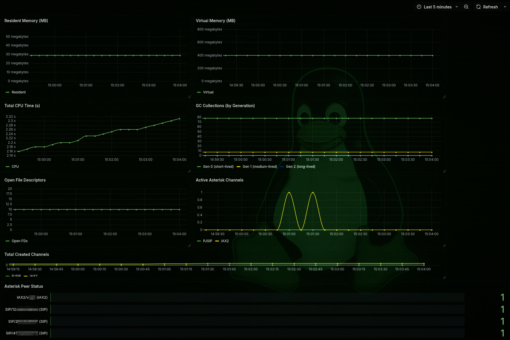

# 📞 Asterisk Monitoring with Prometheus & Grafana

A lightweight monitoring stack for Asterisk PBX using `prometheus`, `grafana`, and `asterisk_exporter`.

## 📦 Stack Components

- **Prometheus** – collects metrics from Asterisk and Python exporter.
- **Grafana** – dashboards for visualizing performance and peer status.
- **asterisk_exporter** – Python-based Prometheus exporter for Asterisk metrics.

---

## 🚀 Quick Start

### 1. Clone the repo

```bash
git clone https://github.com/XlurichX/asterisk-stats.git
cd asterisk-stats
```

### 2. Run the stack via Docker

`docker-compose up -d`

🧰 Files Included

docker-compose.yml – Launches Prometheus and Grafana.

prometheus/prometheus.yml – Prometheus scrape config.

asterisk_dashboard.json – Custom Grafana dashboard to import manually.

README_dashboard.md - Designation of metric components


### 3. 🛠️ asterisk_exporter Setup

Requirements:
python3.6+
python3-pip
/etc/asterisk/manager.conf

Example mananger.conf
```bash
[general]
enabled = yes
port = 5038
bindaddr = 127.0.0.1
[exporter]
secret = gen_pass # openssl rand -base64 24
read = system,call,log,verbose,command,agent,user,config,originate
write = system,call,log,verbose,command,agent,user,config,originate
```

`pip install asterisk-exporter`

Example Run:
```bash
/usr/local/bin/asterisk_exporter start \
  --host 0.0.0.0 \
  --port 8088 \
  --user exporter \
  --password passwd_in_manager.conf&
```

### 4. Launch of grafana

Login into http://docker_ip:3000
admin:admin

Go to Connections=>Data sources=>Prometheus (url - prometheus:9090)

Next we can create a dashboard and import asterisk_dashboard.json

All information on dashboard metrics is in the README_dashboard.md file
If desired, you can improve the metrics by changing the source files asterisk-exporter
